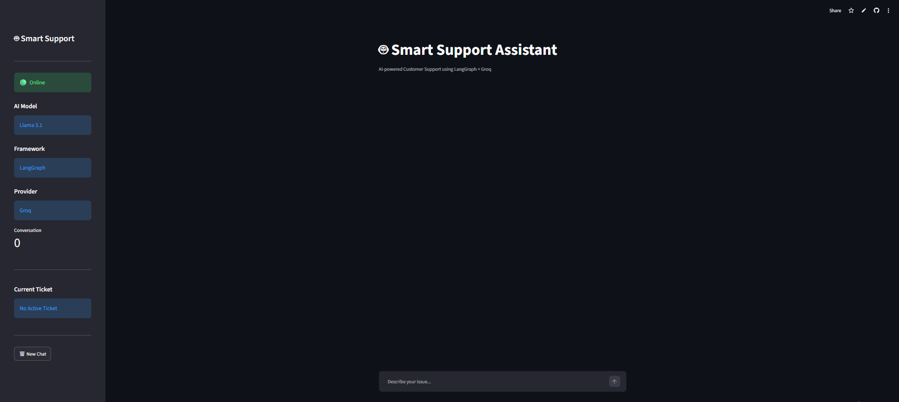
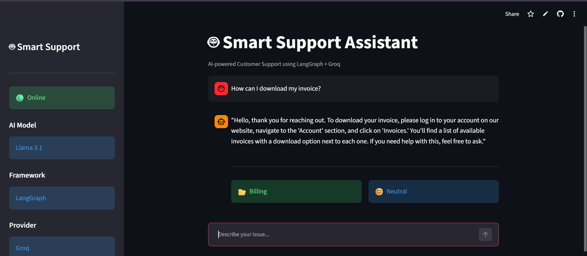
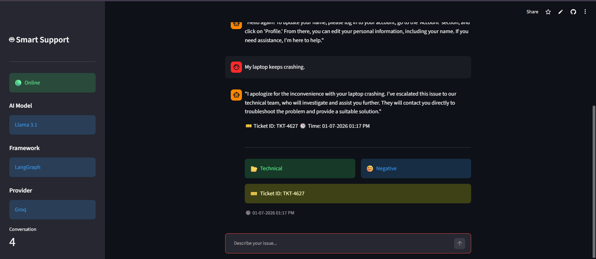
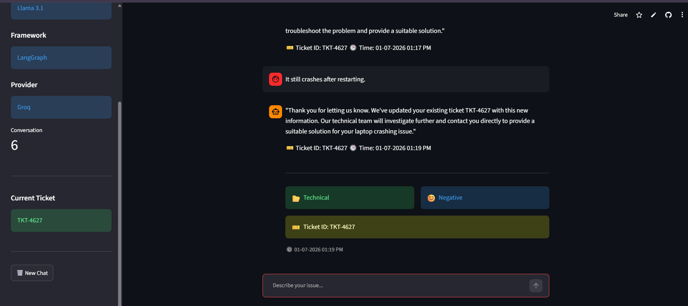

## 🌐 Live Demo

🔗 https://9xmuxzq97mbdmfykbrxojo.streamlit.app/
# 🤖 Smart Support Assistant v1.0

An AI-powered Customer Support Assistant built using **LangGraph**, **Groq Llama 3.1**, and **Streamlit**. The application intelligently categorizes customer queries, analyzes sentiment, manages support tickets, and provides a conversational chat interface.

---

## 🚀 Key Features

- AI-powered customer query classification
- Intelligent sentiment analysis
- Dynamic workflow routing using LangGraph
- Smart ticket creation and updates
- Persistent JSON-based ticket storage
- Interactive Streamlit chat interface
- Conversation history management

---

## 🛠 Tech Stack

- Python
- Streamlit
- LangGraph
- LangChain
- Groq API (Llama 3.1)
- JSON

---

## 🏗 Architecture

```text
User
   │
   ▼
Streamlit UI
   │
   ▼
LangGraph Workflow
   │
   ├── Categorize Query
   ├── Analyze Sentiment
   ├── Handle Query
   └── Ticket Service
           │
           ▼
      tickets.json
```
## ⚙️ Workflow

1. User enters a query.
2. LangGraph categorizes the query.
3. AI analyzes customer sentiment.
4. Workflow decides the next action.
5. AI responds or creates/updates a support ticket.
6. Ticket information is stored in JSON.
---
## 📂 Project Structure

```text
Agent/
│
├── app.py
├── support_agent_v2.py
├── services/
│   └── ticket_service.py
├── utils/
│   ├── helpers.py
│   └── prompts.py
├── data/
│   └── tickets.json
├── requirements.txt
└── README.md
```

---

## 🚀 How to Run

### Clone the repository

```bash
git clone https://github.com/7jayasri/smart-support-assistant.git
cd smart-support-assistant
```

### Install dependencies

```bash
pip install -r requirements.txt
```

### Create a `.env` file

```env
GROQ_API_KEY=your_api_key_here
```

### Start the application

```bash
streamlit run app.py
```

---

## 📸 Screenshots

### Home Page

---
### Chat Conversation



---

### Ticket Creation



---
### Ticket Updation



---


---

## 🔮 Future Improvements

- 📄 RAG using PDF documents
- 🗄 Database integration
- 👤 User authentication
- 📊 Admin dashboard
- ☁ Cloud deployment

---

## 👩‍💻 Author

**Padilam Jaya Sri**
